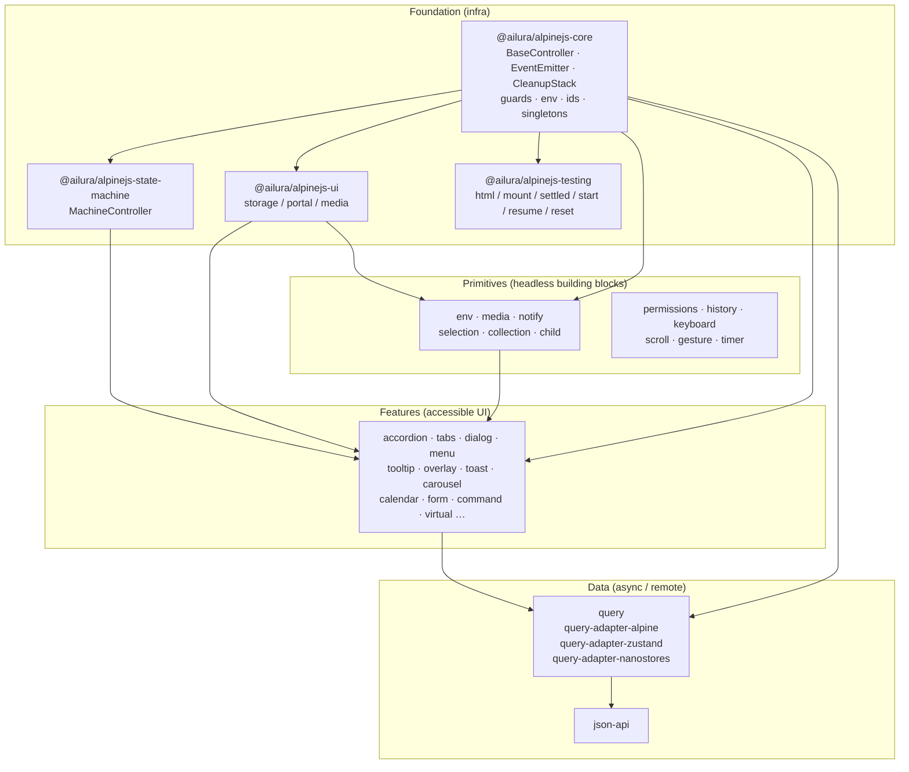
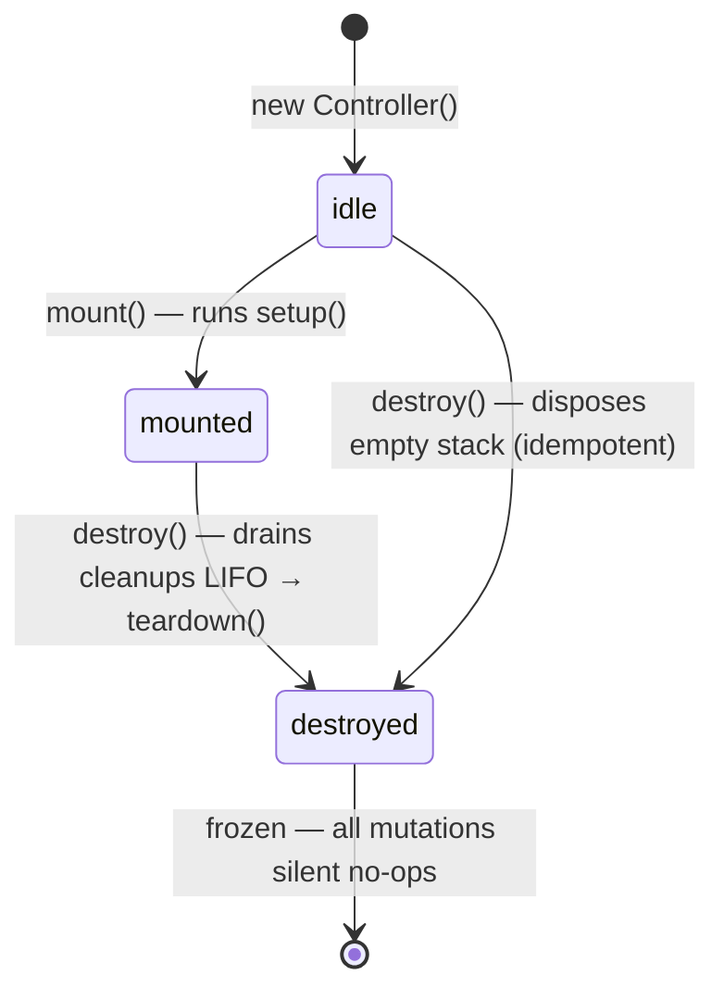

# Alpine.js Toolkit — Architecture

> One ESM-first, SSR-safe monorepo of 40 `@ailura/alpinejs-*` packages sharing a single controller canon and Alpine bridge.

**Status:** `validated` — 2026-09-07 · **30 PASS / 9 WARN (6 + 3 query adapters, exempt by design) / 1 FAIL (demo exempt) = 40 packages** · 0 real failures

**Counts, and where they come from.** Two different numbers are in play and they are not the same one, so do not conflate them:

| Count                                                    | Value  | Derivation                                                                                                                                                                                  |
| -------------------------------------------------------- | ------ | ------------------------------------------------------------------------------------------------------------------------------------------------------------------------------------------- |
| Package folders in `packages/`                           | **40** | `ls -d packages/*/ \| wc -l`                                                                                                                                                                |
| Root `tsconfig.json` project references into `packages/` | **40** | one per folder, no extras, none missing (the file has 41 `"path"` entries; the 41st is `./apps/docs`)                                                                                       |
| Browser plugins in the demo catalog                      | **37** | 40 folders − `ui` (framework-agnostic helpers), `testing` (test harness) and `plugin-template` (scaffold) = **37** that ship a browser plugin. Asserted by `apps/demo/test/catalog.test.ts` |
| Publishable `@ailura/alpinejs-*` packages                | **40** | every folder, including the three that ship no browser plugin: `ui`, `testing` and `plugin-template`                                                                                        |

Every "N packages" in this file means **40** — the folder count. The 37 is the demo catalog's, and it is quoted as such. The gap between 40 and 37 is exactly three packages, and it is one kind of gap: `ui`, `testing` and `plugin-template` ship no browser plugin by design. Every other package — the three query adapters included — registers on Alpine, has a catalog entry and has a demo page.

---

## TL;DR — 5 core ideas

1. **Controllers own state; Alpine owns reactivity.** Framework-agnostic `BaseController` emits `change`; thin `plugin.ts` syncs into `Alpine.store`/`Alpine.magic`.
2. **One canon per package.** Every package ships `package.json` (ESM, `sideEffects:false`), `vite.config.ts` (`vp pack` + `neverBundle`), `tsconfig.json` (extends base), `.size-limit.json`, and `src/index.ts` (barrel) + `types.ts` + `controller.ts` + `plugin.ts`.
3. **Guards prevent silent collisions.** `guardStore` / `guardMagic` / `guardDirective` throw `RegistrationError` on cross-package name reuse.
4. **SSR is safe by default.** No `window`/`document` at import time — only `safeWindow()` / `safeDocument()` / `safeMatchMedia()` from `@ailura/alpinejs-core/env`.
5. **Build and size are enforced.** `vp pack` → ESM + `dts` + `attw`/`publint` + per-package `size-limit` budgets (externalized peers).

---

## 1. Monorepo layout

```
alpinejs-toolkit/
├── apps/
│   └── demo/                     # Vite demo app (consumes workspace:*)
├── packages/
│   ├── core/                     # Foundation — BaseController, guards, env, ids
│   ├── ui/                       # Storage / portal / media primitives
│   ├── state-machine/            # N-state MachineController
│   ├── testing/                  # Test helpers (dev-only)
│   ├── accordion/ … tooltip/     # 35 feature + data packages (canon)
│   └── plugin-template/          # Scaffold source (demo, never published)
├── scripts/
│   └── new-plugin.mjs            # pnpm run new:plugin -- my-plugin
├── pnpm-workspace.yaml           # packages/* + apps/*
├── tsconfig.base.json            # Shared strict config
├── tsconfig.json                 # Project references (40 packages)
├── vite.config.ts                # fmt + lint (vite-plus)
└── package.json                  # Root scripts: build / test / check / size
```

Workspace: `pnpm` + `vite-plus` (`vp`). Root `private:true`, `type:module`.

---

## 2. Layer diagram

Layers flow **downward** — a layer only imports from layers below it.



**Dependency rule:** `core` has zero toolkit peers. `ui` and `state-machine` depend only on `core`. Feature packages depend on `core` (+ optionally `ui`/`state-machine`). Data packages depend on `core` and feature-agnostic adapters. No cycles.

**Third-party runtimes are peers, never dependencies.** All 40 `packages/*/package.json` files have **zero** `dependencies` block. A third-party runtime — `embla-carousel` in `carousel`, `date-fns` in `calendar`, `zustand` in `query-adapter-zustand`, `nanostores` in `query-adapter-nanostores` — is a `peerDependency` plus a devDependency, a `deps.neverBundle` entry in `vite.config.ts`, and an `ignore` in `.size-limit.json`. The host owns the single copy; the package ships glue. See the `query-kit` retirement note in §9 for why that rule is load-bearing rather than incidental.

---

## 3. Package canon — required files

Every publishable package follows the same contract. Deviation is a validation failure unless listed in §10.

| File                | Must contain                                                                                                                                                                                                                         | Notes                                            |
| ------------------- | ------------------------------------------------------------------------------------------------------------------------------------------------------------------------------------------------------------------------------------ | ------------------------------------------------ |
| `package.json`      | `type:module`, `sideEffects:false`, `exports` with `types` + `import`, `main`/`types` pointers, `files:["dist"]`, scripts `build`/`test`/`typecheck`/`size`, `peerDependencies: { alpinejs }` (+ `@ailura/alpinejs-core` where used) | `publishConfig` omitted — workspace publish only |
| `vite.config.ts`    | `defineConfig({ pack: { entry:['src/index.ts'], format:['esm'], minify:true, dts:true, deps:{ neverBundle:[...peers] }, report:{gzip,brotli}, publint:true, attw:{profile:'esm-only'} } })`                                          | `neverBundle` keeps peers external               |
| `tsconfig.json`     | `extends: ../../tsconfig.base.json`, `noEmit:true`, `include: ["src","test"]`                                                                                                                                                        | Root `tsconfig.json` holds project references    |
| `.size-limit.json`  | Single entry `{ name, path:"dist/index.mjs", import:"*", limit:"<budget> kB", ignore:[peers], gzip,brotli }`                                                                                                                         | Budget via `toolkit.bundleBudget.category`       |
| `src/index.ts`      | **Barrel only** — re-exports from `controller.ts`, `plugin.ts`, `types.ts`, `events.ts`/`store.ts`                                                                                                                                   | No logic, no side effects                        |
| `src/types.ts`      | All public type contracts, option interfaces, `DEFAULT_*_STORE_KEY` / `DEFAULT_*_MAGIC_KEY` constants                                                                                                                                | Importable without pulling runtime               |
| `src/controller.ts` | `extends BaseController<Events>`, owns state, `generateId` prefix, typed `emit('change', detail)`                                                                                                                                    | Framework-agnostic; unit-testable without Alpine |
| `src/plugin.ts`     | Factory `xxxPlugin(options) => AlpineCallback`, `const packageName = '@ailura/alpinejs-…'` string, `guardStore`/`guardMagic`/`guardDirective`, sync via `controller.on('change', …)`                                                 | Thin Alpine surface only                         |
| `src/events.ts`     | `Events` map + `ChangeDetail` discriminated union (e.g. `source: 'user' \| 'initialization'`)                                                                                                                                        | Optional if package has no events                |

Reference canon examples: [`packages/accordion`](./packages/accordion) (feature canon), [`packages/theme`](./packages/theme) (machine-backed canon).

### 3.1 package.json — canon shape

```jsonc
{
  "name": "@ailura/alpinejs-accordion",
  "version": "0.1.0",
  "type": "module",
  "sideEffects": false,
  "main": "./dist/index.mjs",
  "types": "./dist/index.d.mts",
  "exports": { ".": { "types": "./dist/index.d.mts", "import": "./dist/index.mjs" } },
  "files": ["dist"],
  "scripts": {
    "build": "vp pack",
    "test": "vp test",
    "typecheck": "tsc --noEmit -p tsconfig.json",
    "size": "size-limit",
  },
  "peerDependencies": { "@ailura/alpinejs-core": "workspace:*", "alpinejs": "^3.0.0" },
}
```

### 3.2 vite.config.ts — canon shape

```ts
import { defineConfig } from "vite-plus";

export default defineConfig({
  pack: {
    entry: ["src/index.ts"],
    format: ["esm"],
    minify: true,
    dts: true,
    deps: { neverBundle: ["alpinejs", "@ailura/alpinejs-core"] },
    report: { gzip: true, brotli: true },
    devtools: true,
    publint: true,
    attw: { profile: "esm-only" },
  },
});
```

### 3.3 tsconfig.json — canon shape

```json
{
  "extends": "../../tsconfig.base.json",
  "compilerOptions": { "noEmit": true },
  "include": ["src", "test"]
}
```

Base (`tsconfig.base.json`): `ES2022` / `Bundler` / `strict` / `declaration` + `declarationMap` / `isolatedModules`.

---

## 4. Controller lifecycle

All state lives in controllers. Alpine is a view adapter.



### 4.1 Base primitives (`@ailura/alpinejs-core/controller`)

| Primitive                 | Role                                                                                                                  |
| ------------------------- | --------------------------------------------------------------------------------------------------------------------- |
| `EventEmitter<TEvents>`   | Typed `on`/`once`/`off`/`emit`; `on` returns unsubscribe; emits snapshot listeners for mid-emit safety                |
| `CleanupStack`            | LIFO `push`/`dispose()`; first error rethrown after drain; idempotent                                                 |
| `BaseController<TEvents>` | `events` + `cleanups` + `lifecycle: 'idle' \| 'mounted' \| 'destroyed'`; subclasses override `setup()` / `teardown()` |

**Rules:** `mount()` is idempotent and only runs once from `idle`. `destroy()` is idempotent and final. After `destroyed`, every mutating method returns early without throwing. `onCleanup(fn)` registers teardowns; `on(event, fn)` auto-registers its unsubscribe.

### 4.2 Example — minimal canon controller

```ts
import { BaseController, generateId } from "@ailura/alpinejs-core";
import type { MyEvents } from "./events";

export class MyController extends BaseController<MyEvents> {
  readonly id: string;
  #value = 0;

  constructor(id?: string) {
    super();
    this.id = id ?? generateId("my");
  }

  private get frozen() {
    return this.lifecycle === "destroyed";
  }

  protected override setup(): void {
    // wire observers; push teardowns via this.cleanups.push(...)
  }

  get value() {
    return this.#value;
  }

  setValue(next: number): void {
    if (this.frozen) return;
    this.#value = next;
    this.emit("change", { value: next, source: "user" });
  }
}

export function createMyController(id?: string) {
  const controller = new MyController(id);
  controller.mount();
  return controller;
}
```

The factory mounts the controller. Callers do **not** call `mount()` themselves
— a standalone consumer writes `createMyController()` and immediately mutates
it. `mount()` is idempotent, so a redundant call is harmless, but it teaches
that the factory is lazy when it is not.

### 4.3 Supporting core modules

| Module                  | Export                                                                                                     | Purpose                                           |
| ----------------------- | ---------------------------------------------------------------------------------------------------------- | ------------------------------------------------- |
| `core/env`              | `isBrowser()`, `safeWindow()`, `safeDocument()`, `safeMatchMedia(q)`                                       | SSR-safe DOM access                               |
| `core/ids`              | `generateId(prefix)`, `resetIdCounter()`                                                                   | Monotonic `base-36` ids; `prefix-counter`         |
| `core/singletons`       | `createSingleton(key, factory, {scope})`, `releaseSingleton`, `clearAllSingletons`                         | Per-`document` cache; SSR gets fresh scope        |
| `core/errors`           | `ToolkitError`, `RegistrationError` (`code: REGISTRATION_COLLISION`)                                       | Stable coded errors                               |
| `core/sync`             | Shared sync helpers                                                                                        | Reactive store shadowing (legacy)                 |
| `core/registration`     | `resolvePluginKeys(options, defaultStoreKey, defaultMagicKey)`, `readAlpineStore(alpine, key[, fallback])` | Registration key fallback chain; typed store read |
| `state-machine/machine` | `MachineController<S,E,T>`                                                                                 | N-state sync machine (see below)                  |

### 4.4 MachineController (`@ailura/alpinejs-state-machine`)

Used by `theme`, `toggle`, and any package that wants an explicit transition graph.

```ts
import { MachineController } from "@ailura/alpinejs-state-machine";

const machine = new MachineController<
  "light" | "dark" | "system",
  "SET_LIGHT" | "SET_DARK" | "SET_SYSTEM"
>({
  initial: "system",
  transitions: [
    { name: "SET_LIGHT", from: "dark", to: "light" },
    { name: "SET_LIGHT", from: "system", to: "light" },
    // … 6 edges total, no self-loops
  ],
});

machine.mount(); // queues one microtask: emit('change', { current, previous, source:'initialization' })
machine.send("SET_DARK"); // → true  (committed) or false (no edge / guard cancelled / destroyed)
machine.setSilently("light"); // hydrate without emit; marks hydrated so pending init microtask no-ops
machine.forState("dark").can("SET_LIGHT"); // typed narrowing via defineMachine tuple inference
```

`theme` owns `current` in the machine; `system`/`resolved` stay derived from `matchMedia` (`resolveTheme`).

---

## 5. Alpine integration

Every Alpine surface is a **factory** that returns an `Alpine.plugin` callback. No side effect at import time.

```ts
// src/plugin.ts — canon shape (accordion is the reference)
import type { Alpine } from "alpinejs";
import { readAlpineStore, resolvePluginKeys } from "@ailura/alpinejs-core";
import { guardMagic, guardStore } from "@ailura/alpinejs-core";
import { MyController } from "./controller";
import type { CreateMyOptions, MyPluginCallback } from "./types";

const packageName = "@ailura/alpinejs-my"; // ← required: literal for guard ownership

export function myPlugin(options: CreateMyOptions = {}): MyPluginCallback {
  const { storeKey, magicKey } = resolvePluginKeys(
    options,
    DEFAULT_MY_STORE_KEY,
    DEFAULT_MY_MAGIC_KEY
  );

  return function registerMy(alpine: Alpine): void {
    const controller = new MyController(options.id);
    const store = createMyStore(controller); // or controller.toStore()

    const sync = () => {
      /* shadow controller state into readAlpineStore(alpine, storeKey, store) */
    };
    const unsubscribe = controller.on("change", sync);

    guardStore(alpine, storeKey, store, packageName);
    if (magicKey) {
      guardMagic(alpine, magicKey, () => readAlpineStore(alpine, storeKey), packageName);
    }

    void unsubscribe; // retained; ordered teardown would be unsubscribe() → controller.destroy()
  };
}

// `src/index.ts` re-exports the factory as the default, and nothing else:
// there is no `export const my = myPlugin` shorthand and no `myOptions`
// identity helper — see §5.2.
export { myPlugin, myPlugin as default } from "./plugin";
```

### 5.1 Guards and collisions

```ts
import { guardStore, guardMagic, guardDirective } from "@ailura/alpinejs-core/guards";

// First package to claim a name owns it; re-registration by the same package is allowed.
guardStore(alpine, "accordion", store, "@ailura/alpinejs-accordion");
// Second package claiming 'accordion' throws:
// RegistrationError { code:'REGISTRATION_COLLISION', kind:'store', registrationName:'accordion',
//   packageName:'@ailura/alpinejs-other', existingPackageName:'@ailura/alpinejs-accordion' }

guardDirective(alpine, "upper", cb, pkg); // 'myDirective' → normalized to 'my-directive'
resetRegistrationTracking(); // called via testing onReset hook
```

Bypass only with `{ override:true }` for intentional takeover.

### 5.2 Factory + sync contract

- **Factory pattern:** `xxxPlugin(options) => (alpine) => void`. Options carry `id?`, `storeKey?`, `magicKey?` so consumers can rename registrations to avoid collisions without forking the controller.
- **Magic follows store:** `magicKey ?? storeKey` — renaming `storeKey` renames both. Resolve both with `resolvePluginKeys(options, DEFAULT_MY_STORE_KEY, DEFAULT_MY_MAGIC_KEY)`; never hand-write the fallback chain.
- **Sync:** `controller.on('change', sync)` where `sync` snapshots controller state into the _reactive_ store proxy returned by `readAlpineStore(alpine, storeKey, store)` — pass the base store as the fallback, because a `sync` can fire before `guardStore` registers the proxy. No legacy `subscribe` bridge — removed.
- **Typed options:** the plugin factory is generic (`xPlugin<const T extends CreateXOptions>(options: T)`), which is what preserves literal inference for consumers. A separate `xxxOptions(o)` identity helper used to be exported by every package; it had zero call sites and was removed as dead code, so this is no longer a separate surface.

---

## 6. SSR contract

**Invariant:** importing any package must never read `window`, `document`, or `matchMedia`. All DOM access is deferred to `setup()`/`mount()` and guarded.

```ts
// ✅ Correct — deferred + guarded
import { safeWindow, safeDocument, safeMatchMedia } from '@ailura/alpinejs-core/env'

protected override setup(): void {
  const win = safeWindow()
  if (!win) return
  const mq = safeMatchMedia('(prefers-color-scheme: dark)')
  // ...
}

// ❌ Wrong — touches DOM at import time
const isDark = window.matchMedia('(prefers-color-scheme: dark)').matches
export const doc = document
```

| Helper              | Returns when unavailable              |
| ------------------- | ------------------------------------- |
| `isBrowser()`       | `false` on server                     |
| `safeWindow()`      | `undefined` on server                 |
| `safeDocument()`    | `undefined` on server                 |
| `safeMatchMedia(q)` | `undefined` when `matchMedia` missing |

`singletons` reuse the document as default scope; without a document each SSR request gets a fresh object so instances never leak across requests. Always check `typeof window !== 'undefined'` or use the helpers above before touching DOM.

---

## 7. Build and size budgets

### 7.1 Toolchain

| Step               | Tool                                | What it does                                                                         |
| ------------------ | ----------------------------------- | ------------------------------------------------------------------------------------ |
| `vp pack`          | `vite-plus` → `tsdown`              | ESM `.mjs` + `.d.mts` + minify + `publint` + `attw` + gzip/brotli report             |
| `neverBundle`      | `vite.config.ts` `deps.neverBundle` | Keeps `alpinejs` and `@ailura/alpinejs-core` external (reported as external in size) |
| `size-limit`       | `.size-limit.json` per package      | Enforces per-package budget; `ignore: [peers]` excludes externals from measurement   |
| `publint` + `attw` | `vp pack` built-ins                 | Validates `exports` map and ESM-only types (`esm-only` profile)                      |

### 7.2 Budgets

Each package declares one `size-limit` entry measuring `dist/index.mjs` with `import:"*"`:

```json
[
  {
    "name": "accordion full surface",
    "path": "dist/index.mjs",
    "import": "*",
    "limit": "2.3 kB",
    "ignore": ["alpinejs", "@ailura/alpinejs-core"],
    "gzip": true,
    "brotli": true
  }
]
```

Categories via `package.json:toolkit.bundleBudget.category`:

- `small-feature` — headless feature controllers (accordion, tabs, …)
- Un-categorized packages use an explicit `limit` in `.size-limit.json`.

### 7.3 Scripts

```sh
pnpm build            # vp run --recursive build   (all packages in parallel)
pnpm size             # vp run --recursive size
pnpm size:why         # per-package breakdown (esbuild-why)
vp pack               # per-package: single ESM + dts build
```

---

## 8. Testing

### 8.1 Helpers (`@ailura/alpinejs-testing`)

Test-only package. Never import from plugin runtime code (`src/index.ts`) or bundle it into `dist`.

| Helper          | Purpose                                                                                                     |
| --------------- | ----------------------------------------------------------------------------------------------------------- |
| `html(snippet)` | Create a detached `HTMLElement` with Alpine directives                                                      |
| `mount(el)`     | Append to `document.body` so Alpine can observe it                                                          |
| `settled()`     | `await Alpine.nextTick()` ×2 — flush reactive queue + DOM                                                   |
| `start(plugin)` | `Alpine.plugin(plugin); Alpine.start()` — call once per file in `beforeAll`                                 |
| `resume()`      | `Alpine.startObservingMutations()` — call in `beforeEach` after state reset                                 |
| `reset()`       | `stopObserving → destroyTree → replaceChildren → run onReset hooks` — call in `afterEach`                   |
| `onReset(fn)`   | Register a hook run by `reset()` (e.g. `resetRegistrationTracking`, `resetIdCounter`, `clearAllSingletons`) |

```ts
// test/setup.ts
import { onReset } from "@ailura/alpinejs-testing";
import { resetRegistrationTracking } from "@ailura/alpinejs-core/guards";
onReset(resetRegistrationTracking);

// my-feature.test.ts
import { html, mount, settled, start, resume, reset } from "@ailura/alpinejs-testing";
import { myPlugin } from "../src/plugin";

beforeAll(() => start(myPlugin()));
beforeEach(() => resume());
afterEach(() => reset());

it("opens on click", async () => {
  mount(html(`<div x-data><button @click="open()">open</button></div>`));
  await settled();
  // assert…
});
```

### 8.2 Environment

- Runner: `vitest` in `node` mode with `happy-dom` (no real browser).
- Each package's own `test` script is `vp test`; run it scoped from the repo root:
  `pnpm exec vp test packages/my-feature`. `pnpm test` at the root runs the whole
  workspace.
- Typecheck is separate and also scoped: `pnpm exec tsc --noEmit -p
packages/my-feature/tsconfig.json` (project references) — never emit from
  `tsc`, only from `vp pack`.

---

## 9. Exceptions by design

Nine WARN (six packages plus the three query adapters) and one demo FAIL are intentional and exempt from the strict canon. All were reviewed 2026-09-07; the counts were recomputed against the tree on 2026-09-08 after the deprecation removals, which took the workspace from 42 packages to 39, again after `query-adapter-zustand` landed, and again after `query-adapter-nanostores` took it to 40.

| Package                            | Verdict       | Extra `exports` / missing file                                                     | Rationale                                                                                                                                                                                                                                                                                                                                                                                                                         |
| ---------------------------------- | ------------- | ---------------------------------------------------------------------------------- | --------------------------------------------------------------------------------------------------------------------------------------------------------------------------------------------------------------------------------------------------------------------------------------------------------------------------------------------------------------------------------------------------------------------------------- |
| `@ailura/alpinejs-core`            | WARN          | 10 subpath exports (`./bridge`, `./controller`, …) + no `plugin.ts`                | Foundation infra consumed as granular subpaths; no Alpine plugin of its own                                                                                                                                                                                                                                                                                                                                                       |
| `@ailura/alpinejs-ui`              | WARN          | 4 subpath exports (`./storage`, `./portal`, `./media`, `./types`) + no `plugin.ts` | Framework-agnostic primitives consumed piecemeal                                                                                                                                                                                                                                                                                                                                                                                  |
| `@ailura/alpinejs-testing`         | WARN          | No `vite.config.ts` / no `dist` (test helper only, not published)                  | Dev-only helper; `exports` maps to `src/index.ts`                                                                                                                                                                                                                                                                                                                                                                                 |
| `@ailura/alpinejs-child`           | WARN          | Extra directives via `guardDirective('child', …)`; no controller class             | Single-directive package. `controller.ts` is a bag of five Alpine-free helpers (attribute parse, child lookup, attribute transfer/merge), but the directive itself is not framework-agnostic: its body needs Alpine internals (`interceptInit`, `addInitSelector`, `morph`, `mutateDom`, `nextTick`, `initTree`). There is no controller class to extract, so the "controller is the directive" exemption does not literally hold |
| `@ailura/alpinejs-notify`          | WARN          | Extra `Notification` API surface + permission request                              | Browser API wrapper; shape differs from store/magic-only packages                                                                                                                                                                                                                                                                                                                                                                 |
| `@ailura/alpinejs-state-machine`   | WARN          | No Alpine store (pure machine); exposes `defineMachine` + `MachineController`      | Generic state primitive; store is consumer-owned                                                                                                                                                                                                                                                                                                                                                                                  |
| `query-adapter-alpine`             | WARN*         | Adapter — no `plugin.ts` of its own (plugs into `query`)                           | One of the three `QueryStateAdapter` implementations. Counted as one of the nine WARN rows, not as a separate slot                                                                                                                                                                                                                                                                                                                |
| `query-adapter-zustand`            | WARN*         | Adapter — no `plugin.ts` of its own (plugs into `query`)                           | A second `QueryStateAdapter` implementation. Same exemption as its siblings, same counting rule                                                                                                                                                                                                                                                                                                                                   |
| `query-adapter-nanostores`         | WARN*         | Adapter — no `plugin.ts` of its own (plugs into `query`)                           | The third `QueryStateAdapter` implementation. Same exemption, same counting rule. It has a catalog entry and a demo page like its two siblings                                                                                                                                                                                                                                                                                    |
| `@ailura/alpinejs-plugin-template` | FAIL (exempt) | Minimal demo, not published                                                        | Copy-paste scaffold for `pnpm run new:plugin`; fixed theme/query-adapter failures left only this demo as FAIL                                                                                                                                                                                                                                                                                                                     |

> \*`query-adapter-alpine`, `query-adapter-zustand` and `query-adapter-nanostores` are **the adapter family**: three packages implementing the one `QueryStateAdapter` contract that `@ailura/alpinejs-query` owns, each registered under the same key `"query"` so a host can swap one for the other without renaming anything. What differs between them is the store the published snapshot lands in — an `Alpine.reactive` box, a `zustand/vanilla` store, a `nanostores` atom — and therefore what a host can observe. Two earlier revisions of this file are wrong and are recorded here so they are not reintroduced: one called `query-adapter-alpine` "the single remaining `QueryStateAdapter` implementation", which is a smaller claim than the truth and, after the other two landed, a false one; and another counted the family as two. The family is three. All three are counted **once each**, as three of the nine WARN rows, and none is folded into another package's slot. The table therefore holds ten rows over 40 packages: 40 − 9 WARN − 1 FAIL = **30 PASS**. The validator reports **30 PASS / 9 WARN / 1 FAIL** with **0 real failures**. Note that PASS stayed at 30 across that last addition: the new package is a WARN row, so the folder count rose by one and PASS did not. An earlier revision of this section claimed "5 WARN" while listing six package names and a 35/5/1 split totalling 41 — that arithmetic was never reconcilable with the package count, and has been recomputed from the table rather than adjusted in place.

### 9.1 Retired and superseded

Two migration facts. Neither package below exists in the tree, and neither is planned to return.

- **`@ailuracode/alpine-query-kit` is retired and will not be re-created.** It is gone by decision, not by omission. The retirement is finished, not pending: **both** surfaces it owned now have a home in this repo, and neither came back as the old package. The mapping, old surface to new home:

  | Old `@ailuracode/alpine-query-kit` surface       | New home                                                                                               | State                                                                                                                                             |
  | ------------------------------------------------ | ------------------------------------------------------------------------------------------------------ | ------------------------------------------------------------------------------------------------------------------------------------------------- |
  | The devtools panel                               | `@ailura/alpinejs-query/devtools` — `queryDevtoolsPlugin`, `mountQueryDevtools`                        | **Shipped.** A real subpath export: `packages/query/package.json` declares `"./devtools"`, and the module lives in `packages/query/src/devtools/` |
  | The snapshot contract the panel read             | `QueryDevtoolsApi` on `QueryController`, reachable at `$store.query.devtools`                          | **Shipped.** `getSnapshot()` and `subscribe(cb)`, unchanged in name and in shape                                                                  |
  | The nanostores state backend                     | `@ailura/alpinejs-query-adapter-nanostores` — `createNanostoresStoreAdapter`, `nanostoresStoreAdapter` | **Shipped.** A peer package, not a re-export: `nanostores` is a `peerDependency`, never bundled                                                   |
  | The `NanoStores` / `$nano` / `x-nano` re-exports | Nothing. `@nanostores/alpine` owns those names and a host registers them itself                        | **Deliberately not carried over** — see below                                                                                                     |

  The panel is a port, not a copy of the old entry: it is rewritten to be SSR-safe through `safeDocument()` / `safeWindow()` / `isBrowser()` from `@ailura/alpinejs-core/env` instead of the old raw `document` / `window` / `localStorage` access, `queryDevtoolsPlugin` defers to `alpine:initialized` with a listener it can remove again, it consumes `QueryDevtoolsApi` (`getSnapshot()` / `subscribe(cb)`) and nothing else, and its **Edit** tab is enabled only when the mounted source exposes `setData` — `QueryDevtoolsApi` itself is read-only, and a bare `{ devtools }` source gets a disabled tab with the reason printed, not a dead Apply button. It ships from its own subpath so a production bundle that never imports it carries none of it: budgeted separately at `14 kB` gzip, against a measured `47.98 kB raw / 12.81 kB gzip / 11.31 kB brotli`.

  What was **not** carried over is the dependency shape, and that is the point. Every one of the 40 packages has zero runtime `dependencies`, and a third-party runtime is a peer + devDep + `neverBundle` + `size-limit` `ignore` (the `carousel` / `embla-carousel` precedent, now also `query-adapter-zustand` with `zustand` and `query-adapter-nanostores` with `nanostores`). So `nanostores` was **not** pulled into `query`: it became a separate adapter package in the same family as its two siblings, and every named Alpine surface the old package registered is now either owned by `query` or deliberately left to the host.

- **`@ailura/alpinejs-state-machine` is the successor of the old `alpine-toggle`, and `alpine-toggle` is not being re-created.** That is a migration fact, not a feature claim. `state-machine` is an N-state `MachineController` in the tree (`packages/state-machine/src/machine.ts`, exported from `src/index.ts` alongside `defineMachine`), consumed by `theme` (`packages/theme/src/controller.ts` constructs one for `ThemePreference`); re-verified against the tree on this pass. The tree supports no mapping from an `alpine-toggle` source to it beyond the migration itself, and none is asserted here. Whatever the old package did that `MachineController` does not, is not ported.

---

## 10. Adding a new package

### 10.1 Scaffold

```sh
pnpm run new:plugin -- my-plugin
# creates packages/my-plugin from packages/plugin-template
# renames tokens: plugin-template → my-plugin, pluginTemplate → myPlugin
# add { "path": "./packages/my-plugin" } to tsconfig.json references
```

### 10.2 Checklist (canon)

- [ ] `package.json` — `type:module`, `sideEffects:false`, correct `exports`/`types`/`main`, `peerDependencies` includes `alpinejs` + `@ailura/alpinejs-core`
- [ ] `vite.config.ts` — `vp pack` with `neverBundle` for every peer
- [ ] `tsconfig.json` — `extends: ../../tsconfig.base.json`, `noEmit:true`, `include: ["src","test"]`
- [ ] `.size-limit.json` — one entry, `path:"dist/index.mjs"`, `import:"*"`, realistic `limit`, `ignore:[peers]`
- [ ] `src/types.ts` — public types + `DEFAULT_*_STORE_KEY` / `DEFAULT_*_MAGIC_KEY` + `Create*Options` with `storeKey?`/`magicKey?`
- [ ] `src/controller.ts` — `extends BaseController<Events>`, `generateId('my')`, `emit('change', detail)`, frozen guard
- [ ] `src/plugin.ts` — `const packageName`, factory `myPlugin(options) => (alpine) => void`, `guardStore`/`guardMagic`, sync via `controller.on('change')`, `typeof document` guards
- [ ] `src/index.ts` — barrel only (no logic)
- [ ] `src/events.ts` — `Events` map (if emitting)
- [ ] `test/` — `setup.ts` wires `onReset(resetRegistrationTracking)`, happy-dom tests using `html`/`mount`/`settled`
- [ ] `pnpm build && pnpm test && pnpm size` passes; `publint`/`attw` clean

### 10.3 Naming

Package: `@ailura/alpinejs-<kebab>` · Store default: `<kebab>` (e.g. `accordion`) · Magic default: same key (`$accordion`). Directive keys are kebab-cased and auto-lowercased.

---

## 11. All 40 packages by layer

| #   | Package                                     | Layer      | One-line description                                                              |
| --- | ------------------------------------------- | ---------- | --------------------------------------------------------------------------------- |
| 1   | `@ailura/alpinejs-core`                     | Foundation | Shared controllers, guards, bridges, SSR helpers                                  |
| 2   | `@ailura/alpinejs-ui`                       | Foundation | Storage adapters, media query listeners, portal helpers                           |
| 3   | `@ailura/alpinejs-state-machine`            | Foundation | N-state sync machine, transition graph, sync guards                               |
| 4   | `@ailura/alpinejs-testing`                  | Foundation | Alpine integration-test helpers (html/mount/settled/start/reset)                  |
| 5   | `@ailura/alpinejs-env`                      | Primitives | Network / visibility / battery / platform magics                                  |
| 6   | `@ailura/alpinejs-media`                    | Primitives | Responsive breakpoints & motion-preference controller                             |
| 7   | `@ailura/alpinejs-notify`                   | Primitives | Notification magic with permission & service-worker support                       |
| 8   | `@ailura/alpinejs-selection`                | Primitives | Single / multiple / range selection primitives                                    |
| 9   | `@ailura/alpinejs-collection`               | Primitives | Filtering, sorting, grouping, pagination, active-item nav                         |
| 10  | `@ailura/alpinejs-child`                    | Primitives | `x-child` asChild-style attribute transfer directive                              |
| 11  | `@ailura/alpinejs-scroll`                   | Primitives | Position tracking, body lock, section observer & nav                              |
| 12  | `@ailura/alpinejs-calendar`                 | Primitives | Headless calendar — date-fns, single/range, selection helpers                     |
| 13  | `@ailura/alpinejs-form`                     | Primitives | Headless form state & validation (fields, errors)                                 |
| 14  | `@ailura/alpinejs-gesture`                  | Primitives | Pointer-event gestures: tap / swipe / pan / pinch / long-press                    |
| 15  | `@ailura/alpinejs-keyboard`                 | Primitives | Scoped shortcut registry — chords, sequences, conflict resolution                 |
| 16  | `@ailura/alpinejs-history`                  | Primitives | Undo/redo history controller (push/undo/redo/canUndo)                             |
| 17  | `@ailura/alpinejs-timer`                    | Primitives | Countdown / countup / stopwatch magic (drift-resistant engine)                    |
| 18  | `@ailura/alpinejs-toast`                    | Primitives | Toast queue with positions, variants, auto-dismiss                                |
| 19  | `@ailura/alpinejs-transfer`                 | Primitives | Outbound transfer magics: clipboard / share / export                              |
| 20  | `@ailura/alpinejs-permissions`              | Primitives | Browser permission registry with adapter contract                                 |
| 21  | `@ailura/alpinejs-geo`                      | Primitives | Geolocation store with `watchPosition` & SSR guards                               |
| 22  | `@ailura/alpinejs-lang`                     | Primitives | Language store: detect / query / manage app language                              |
| 23  | `@ailura/alpinejs-accordion`                | Features   | Accessible accordion — single/multiple, keyboard, ARIA                            |
| 24  | `@ailura/alpinejs-tabs`                     | Features   | Accessible tabs — orientation, keyboard, ARIA                                     |
| 25  | `@ailura/alpinejs-dialog`                   | Features   | Accessible dialog — open/close, focus trap, scroll lock                           |
| 26  | `@ailura/alpinejs-menu`                     | Features   | Accessible menu — orientation, keyboard, exclusive mode                           |
| 27  | `@ailura/alpinejs-tooltip`                  | Features   | Accessible tooltip — delay, hover/focus, keyboard dismiss                         |
| 28  | `@ailura/alpinejs-overlay`                  | Features   | Portal root via `alpine-ui`, z-index & stack management                           |
| 29  | `@ailura/alpinejs-attention`                | Features   | Screen Wake Lock & Idle Detection magics                                          |
| 30  | `@ailura/alpinejs-theme`                    | Features   | Light/dark/system theme — MachineController-backed, storage & cross-tab sync      |
| 31  | `@ailura/alpinejs-sidebar`                  | Features   | Sidebar visibility, overlay, keyboard & responsive breakpoints                    |
| 32  | `@ailura/alpinejs-carousel`                 | Features   | Embla-powered carousel — autoplay, loop, ARIA                                     |
| 33  | `@ailura/alpinejs-command`                  | Features   | Command palette — ranked filtering, recent/pinned, async execution                |
| 34  | `@ailura/alpinejs-virtual`                  | Features   | Virtual list — fixed/variable sizes, overscan, scroll modes                       |
| 35  | `@ailura/alpinejs-query`                    | Data       | TanStack-Query-style cache — staleTime/retries/mutations                          |
| 36  | `@ailura/alpinejs-query-adapter-alpine`     | Data       | Alpine.reactive-backed `QueryStateAdapter`                                        |
| 37  | `@ailura/alpinejs-query-adapter-zustand`    | Data       | zustand/vanilla-backed `QueryStateAdapter` — one store per handle, peer `zustand` |
| 38  | `@ailura/alpinejs-query-adapter-nanostores` | Data       | nanostores-backed `QueryStateAdapter` — one atom per handle, peer `nanostores`    |
| 39  | `@ailura/alpinejs-json-api`                 | Data       | JSON:API client — schema-typed fetch, sparse fieldsets, includes                  |
| 40  | `@ailura/alpinejs-plugin-template`          | Template   | Scaffold source (demo only, never published)                                      |

35 canon packages + 5 infra (`core`, `ui`, `state-machine`, `testing`, `plugin-template`) = **40 total**.

Row 38's real numbers: budget category `small-feature` (from `package.json:toolkit.bundleBudget.category`), size budget **500 B** gzip (`.size-limit.json`, measured against `dist/index.mjs` with `import: "*"`, with `alpinejs`, `@ailura/alpinejs-core`, `@ailura/alpinejs-query` and `nanostores` in `ignore`), measured `0.84 kB raw / 439 B gzip / 0.39 kB brotli`; peer set `alpinejs`, `@ailura/alpinejs-core`, `@ailura/alpinejs-query`, `nanostores` — four peers, all in `deps.neverBundle`. It registers no magic and no directive, and does not depend on `@nanostores/alpine`; its demo page mounts an adapter built in `apps/demo/src/demo/query-nanostores-demo.ts`, which is where the atoms it hands back are kept. Row 37's numbers: `small-feature`, budget **600 B** gzip, peer set `alpinejs`, `@ailura/alpinejs-core`, `@ailura/alpinejs-query`, `zustand` — four peers. Row 36 is its sibling with three peers and a `3 kB` budget.

---

## 12. Validation

### 12.1 Commands

```sh
# Typecheck (no emit — emit is vp pack's job)
tsc --noEmit -p tsconfig.json          # root references: 40 packages
# or
pnpm typecheck                         # tsc + vp run --recursive typecheck

# Build
pnpm build                             # vp run --recursive build  (vp pack per package)
vp run --recursive build --filter "accordion"

# Tests
pnpm test                              # vp test  (happy-dom, node mode), whole workspace
pnpm exec vp test packages/core        # one package, scoped from the repo root

# Full gate
pnpm check                             # lint + typecheck + tests (vp check)
pnpm lint                              # vp lint (type-aware, typeCheck:false)
pnpm size                              # size-limit per package (gzip + brotli)

# Packaging checks (run by vp pack automatically)
publint                                # exports / files validity
attw --profile esm-only                # are-the-types-wrong (ESM-only types)
```

### 12.2 Architecture validation rules (R1–R12)

The canon validator is the **structure itself** — `vp` and the rules below. Any violation outside §9 exceptions is a real failure.

| #   | Rule                                                           | Check                                                                                                                    |
| --- | -------------------------------------------------------------- | ------------------------------------------------------------------------------------------------------------------------ |
| R1  | `package.json` is ESM, side-effect free, and exports correctly | `type:module` && `sideEffects:false` && `exports["."]` has `types` + `import` + `main`/`types` pointers                  |
| R2  | Single ESM entrypoint via `vp pack`                            | `vite.config.ts` exists and `pack.entry === ["src/index.ts"]`                                                            |
| R3  | Peers are never bundled                                        | `vite.config.ts: pack.deps.neverBundle` includes every `peerDependency`                                                  |
| R4  | Size is budgeted and measured externally                       | `.size-limit.json` exists, one entry on `dist/index.mjs`, `ignore` covers externals                                      |
| R5  | Types extend the base                                          | `tsconfig.json extends ../../tsconfig.base.json` + `noEmit:true`                                                         |
| R6  | Public entry is a barrel                                       | `src/index.ts` contains only `export … from './…'` (no logic / no side effects)                                          |
| R7  | Controller owns state                                          | `src/controller.ts` defines `extends BaseController` + `generateId` + typed `emit('change',…)`                           |
| R8  | Plugin is a guarded factory                                    | `src/plugin.ts` defines `const packageName` + factory `xxxPlugin(options) => (alpine)=>void` + `guardStore`/`guardMagic` |
| R9  | No DOM at import time                                          | `grep -R "window\.                                                                                                       | document\." packages/*/src/index.ts`is empty;`src/env.ts`consumers use`safeWindow`/`safeDocument` |
| R10 | SSR-safe DOM                                                   | `typeof window` / `typeof document` or helpers guard every DOM access                                                    |
| R11 | Subpath exports are only for infra                             | Only `core` and `ui` (and adapters where justified) expose `./subpath` exports                                           |
| R12 | Publish surface is minimal                                     | `files:["dist"]` only; no stray `src` in tarball; `attw` `esm-only` + `publint` pass                                     |

**Current gate (2026-09-07, counts recomputed against the 40-package tree):** 30 PASS · 9 WARN exempt (§9, all three query adapters) · 1 FAIL exempt (`plugin-template` demo) · 0 real FAILs. Fixing `theme` and the query-adapter family closed the last real failures. Adding `query-adapter-nanostores` moved the folder count 39 → 40 and the WARN count 8 → 9, so PASS is unchanged at 30. An earlier revision of this line read "35 PASS · 5 WARN", which totalled 41 and contradicted both the package count and the §9 table it cited.

---

## References

- Canon feature implementation: [`packages/accordion/src/`](./packages/accordion/src/) — `controller.ts`, `plugin.ts`, `types.ts`, `store.ts`, `events.ts`
- Machine-backed implementation: [`packages/theme/src/`](./packages/theme/src/) — `MachineController` + `createSingleton` + `safeMatchMedia`
- Foundation: [`packages/core/src/`](./packages/core/src/) — `controller.ts`, `env.ts`, `guards.ts`, `ids.ts`, `singletons.ts`
- UI primitives: [`packages/ui/src/`](./packages/ui/src/) — `storage.ts`, `portal.ts`, `media.ts`
- State machine: [`packages/state-machine/src/`](./packages/state-machine/src/) — `machine.ts`, `defineMachine` (types)
- Test helpers: [`packages/testing/src/index.ts`](./packages/testing/src/index.ts)
- Scaffold: [`packages/plugin-template/`](./packages/plugin-template/) + [`scripts/new-plugin.mjs`](./scripts/new-plugin.mjs)
- Workspace build docs: [`vite-plus` pack](https://vite-plus.dev)

---

_Generated for the validated canon on `main` — 2026-09-07. Keep this file as the single source of truth; update it with every canon change and re-run the validation gate._
